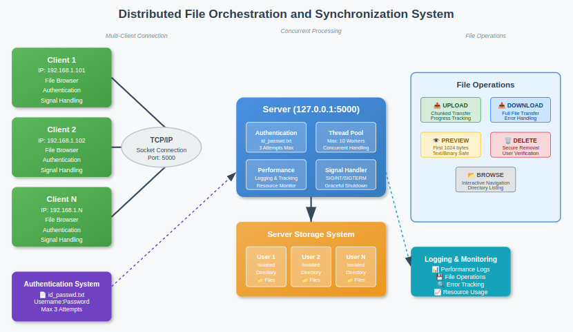

# 🗄️ Distributed File Orchestration and Synchronization System
### A multi-client, socket-based file transfer system for Linux


---

This project is a multi-client file transfer system built using **Python** and Unix-based **socket programming**. It supports concurrent client connections and enables secure file operations such as uploads, downloads, previews, deletions, and directory listings. The server gracefully handles client disconnections and supports controlled shutdown using `CTRL+C`.

## 📊 Architecture Overview



---

## 🌟 Features
- **Client Authentication**: Secure login using the `id_passwd.txt` file.
- **File Operations**:
  - Upload files to the server.
  - Download files securely.
  - Preview the first 1024 bytes of any file.
  - Delete files from the server.
  - List files in the client's directory.
- **Concurrency**: Handles multiple clients at once.
- **Signal Handling**: Allows safe server shutdown with `CTRL+C`.
- **Error Handling**: Comprehensive error reporting for a smooth client-server experience.

---

## 💻 Technology
- **Python 3**: Core programming language.
- **Unix Sockets**: For seamless client-server communication.

---

## ⚙️ Functional Requirements
- **Client Authentication**:
  - Username and password verification from `id_passwd.txt`.
- **File Operations**:
  - **Upload**, **Download**, **View**, **Delete**, and **List** files securely.
- **Multi-client Concurrency**:
  - Supports multiple concurrent client connections.

---

## 📐 Non-Functional Requirements
- **Performance**: Efficient file operations for multiple clients.
- **Security**: Isolated client directories to prevent data leaks.
- **Scalability**: Ability to handle more clients with minimal code adjustments.

---

## 🔧 Setup
1. **Clone the repository**:
   ```bash
   git clone https://github.com/Cloud-Computing-Big-Data/EC-Team-32-distributed-file-orchestration-and-synchronization.git
   or
   git clone git@github.com:Cloud-Computing-Big-Data/EC-Team-32-distributed-file-orchestration-and-synchronization.git
2.  **Ensure Python3 is installed**
3. **Run the Server**:
   ```bash
   python3 server.py
4. **Run the client in a seperate terminal**
   ```bash
   python3 client.py
5. **Run the client in a seperate terminal in a different device**
   ```bash
   python3 client.py
   ```
   Before running the above command, just change the name of the ip adress in client.py code with the ip address of the server device

---

## ▶️ Usage
- Run the server and open one or more clients on separate terminals.
- Use the client to:
   - Authenticate using your credentials.
   - Perform operations like file upload, download, preview, delete, and list.
- To gracefully exit the server, press `CTRL+C`.


---

## 🛑 Signal Handling
- The server catches signals such as `SIGINT` to ensure a controlled shutdown.
- This allows ongoing operations to complete and prevents data corruption.

---

## 🚨 Error Handling
- **Authentication Failures**: Invalid usernames or passwords are promptly rejected.
- **File Not Found**: Clients are notified if they request non-existent files.
- **Concurrent Errors**: Proper handling to ensure smooth operation under multi-client access.

---

## Project Link: [https://github.com/username/distributed-file-orchestration](https://github.com/vandanaj0110/Distributed-File-Orchestration-And-Synchronization)


